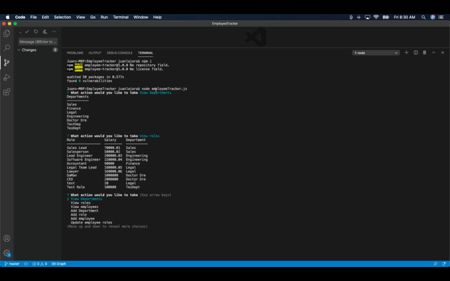

<h1 align='center'>Project 2</h1>
  <!-- <div align='center'>
     </div> -->

## 💡 Project Overview

Welcome to **Project 2!** This is yet another important milestone in your full-stack journey: designing and building your first full-stack web application. You and your team will design and build an app using the MVC paradigm and your own server-side API. You will also continue to add to your professional repertoire with testing, continuous integration and linting tools.

## ✨ User Story

```
TBD
```

## ⚓ Minimum Requirements

- **Application Requirements**

  - Must use a Node and Express server

  - Must use Handlebars.js as the template engine or React.js

  - Must be backed by a MySQL database with a Sequelize ORM

  - Must utilize both GET and POST routes for retrieving and adding new data

  - Must be deployed using Heroku (with data)

  - Must utilize at least one new library, package, or technology that we haven’t discussed

  - Must have a polished front end/UI

  - Must have a folder structure that meets the MVC paradigm

  - Must meet good quality coding standards (indentation, scoping, naming)

  - Must protect API keys in Node with environment variables

- **Presentation Requirements**

  - Use this [project presentation template](https://docs.google.com/presentation/d/1_u8TKy5zW5UlrVQVnyDEZ0unGI2tjQPDEpA0FNuBKAw/edit?usp=sharing) to address the following:

  - Elevator pitch: a one minute description of your application

  - Concept: What is your user story? What was your motivation for development?

  - Process: What were the technologies used? How were tasks and roles broken down and assigned? What challenges did you encounter? What were your successes?

  - Demo: Show your stuff!

  - Directions for Future Development

  - Links to to the deployed application and the GitHub repository

- **Visual Representation**:

    <details>
    <summary>🌟 Wireframes (click to view/collapse)</summary>
    1 of 1
    
    </details>

## 📦 Setup and Instructions

- TBD [LiveLink](https://www.mysqltutorial.org/).

  ### Tools & Packages

  > #### NPM Packages (TBD)
  >
  > - Used the [MySQL](https://www.npmjs.com/package/mysql) NPM package to connect to your MySQL database and perform queries.
  >
  > - Used [InquirerJs](https://www.npmjs.com/package/inquirer/v/0.2.3) NPM package to interact with the user via the command-line.
  >
  > - Used [console.table](https://www.npmjs.com/package/console.table) to print MySQL rows to the console. There is a built-in version of `console.table`, but the NPM package formats the data a little better for our purposes.

## 📽️ The following animation demonstrates the application's functionality:



##  Contributor(s)

<table>
  <tr>
    <td align="center"><a href="https://juanlajara.github.io/portfolio.html"><br /><sub><b>Andres Lajara</b></sub></a><br />
    <a href="https://github.com/juanlajara"></a>
    <a href="https://www.linkedin.com/in/juan-andres-lajara-179a8442"></a>
    <details>
      <summary style="font-size:10px"><b>Click<b> to view More</summary>

[](https://github.com/anuraghazra/github-readme-stats)

  </details>

  </td> 
  
  <td align="center"><a href="https://ashleylerma.github.io/index.html"><br /><sub><b>Ashley Lerma</b></sub></a><br />
   <a href="https://github.com/AshleyLerma"></a>
   <a href="https://www.linkedin.com/in/ashleylerma"></a>
    <details>
      <summary style="font-size:10px"><b>Click<b> to view More</summary>

[](https://github.com/anuraghazra/github-readme-stats)

  </details>

  </td>

  <td align="center">
  <a href=""><br /><sub><b>Jordan Neill</b></sub></a><br />
   <a href="https://github.com/jordanalexis6"></a>
   <a href="https://www.linkedin.com/in/jordan-neill-a48b681a0/"></a>
    <details>
      <summary style="font-size:10px"><b>Click<b> to view More</summary>

[](https://github.com/anuraghazra/github-readme-stats)

  </details>

  </td>

  <td align="center"><a href=""><br /><sub><b>Kevin Holder</b></sub></a><br />
   <a href="https://github.com/kholder777"></a>
   <a href="https://www.linkedin.com/in/kevin-holder-25476788/"></a>
    <details>
      <summary style="font-size:10px"><b>Click<b> to view More</summary>

[](https://github.com/anuraghazra/github-readme-stats)

  </details>

  </td>

  </tr>

</table>

##  Grading Metrics

| Metric        | Weight |
| ------------- | ------ |
| Concept       | 10%    |
| Design        | 20%    |
| Functionality | 30%    |
| Collaboration | 30%    |
| Presentation  | 10%    |
